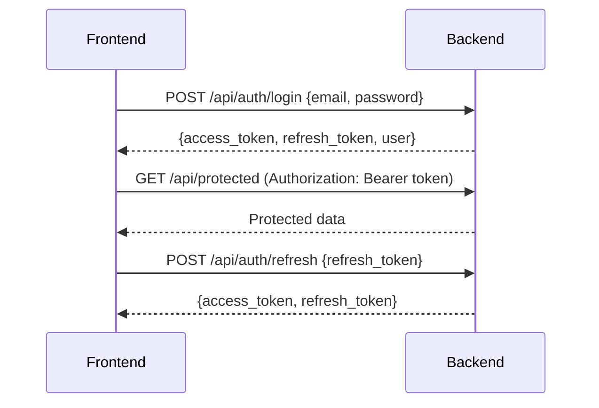

# OpenBoard Backend - Laravel with PostgreSQL

This directory contains the Laravel backend for the OpenBoard Education Management System.

## Architecture Overview

### System Components

```
┌───────────────────────────────────────────────────────────────┐
│                        OpenBoard System                        │
├─────────────────┬─────────────────┬─────────────────┬───────────┤
│  React Frontend  │  Laravel API    │  PostgreSQL     │  Storage │
│  (Vite)          │  (Backend)      │  Database       │  (S3)     │
└─────────────────┴─────────────────┴─────────────────┴───────────┘
```

### API Architecture

```
┌───────────────────────────────────────────────────────────────┐
│                        Laravel API Architecture               │
├─────────────────┬─────────────────┬─────────────────┬───────────┤
│  HTTP Layer     │  Service Layer  │  Repository      │  Models  │
│  (Controllers)  │  (Business      │  (Database      │  (Eloquent)│
│                 │  Logic)         │  Access)        │           │
└─────────────────┴─────────────────┴─────────────────┴───────────┘
```

## Database Schema

### Core Tables

```mermaid
erd
  classDiagram
    class users {
      +id
      +name
      +email
      +password
      +role
      +center_id
      +remember_token
      +created_at
      +updated_at
    }
    
    class centers {
      +id
      +name
      +code
      +address
      +phone
      +email
      +status
      +created_at
      +updated_at
    }
    
    class sessions {
      +id
      +name
      +start_date
      +end_date
      +is_active
      +created_at
      +updated_at
    }
    
    class classes {
      +id
      +name
      +created_at
      +updated_at
    }
    
    class subjects {
      +id
      +name
      +code
      +class_id
      +max_marks
      +created_at
      +updated_at
    }
    
    class students {
      +id
      +center_id
      +name
      +email
      +phone
      +class_id
      +roll_number
      +session_id
      +father_name
      +mother_name
      +dob
      +address
      +photo
      +registration_date
      +created_at
      +updated_at
    }
    
    class marks {
      +id
      +student_id
      +subject_id
      +session_id
      +marks
      +max_marks
      +entered_by
      +entered_at
      +created_at
      +updated_at
    }
    
    class payments {
      +id
      +student_id
      +amount
      +status
      +payment_date
      +transaction_id
      +session_id
      +created_at
      +updated_at
    }
    
    class fee_structures {
      +id
      +session_id
      +class_id
      +amount
      +description
      +created_at
      +updated_at
    }
    
    class timetables {
      +id
      +session_id
      +class_id
      +file_url
      +uploaded_at
      +created_at
      +updated_at
    }
    
    class results {
      +id
      +session_id
      +class_id
      +is_published
      +published_at
      +created_at
      +updated_at
    }
    
    class certificates {
      +id
      +student_id
      +type
      +issued_date
      +certificate_number
      +created_at
      +updated_at
    }
    
    users "1" -- "0..*" centers : manages
    centers "1" -- "0..*" students : contains
    sessions "1" -- "0..*" students : current
    classes "1" -- "0..*" students : belongs to
    classes "1" -- "0..*" subjects : has
    students "1" -- "0..*" marks : has
    students "1" -- "0..*" payments : has
    sessions "1" -- "0..*" fee_structures : has
    sessions "1" -- "0..*" timetables : has
    sessions "1" -- "0..*" results : for
    students "1" -- "0..*" certificates : has
```

## API Endpoints

### Authentication
- `POST /api/auth/login` - User login
- `POST /api/auth/logout` - User logout
- `POST /api/auth/refresh` - Refresh token
- `GET /api/auth/me` - Get current user

### Centers
- `GET /api/centers` - List all centers
- `POST /api/centers` - Create new center
- `GET /api/centers/{id}` - Get center details
- `PUT /api/centers/{id}` - Update center
- `DELETE /api/centers/{id}` - Delete center
- `PUT /api/centers/{id}/status` - Update center status

### Sessions
- `GET /api/sessions` - List all sessions
- `POST /api/sessions` - Create new session
- `GET /api/sessions/{id}` - Get session details
- `PUT /api/sessions/{id}` - Update session
- `DELETE /api/sessions/{id}` - Delete session

### Classes
- `GET /api/classes` - List all classes
- `POST /api/classes` - Create new class
- `GET /api/classes/{id}` - Get class details
- `PUT /api/classes/{id}` - Update class
- `DELETE /api/classes/{id}` - Delete class

### Subjects
- `GET /api/subjects` - List all subjects
- `POST /api/subjects` - Create new subject
- `GET /api/subjects/{id}` - Get subject details
- `PUT /api/subjects/{id}` - Update subject
- `DELETE /api/subjects/{id}` - Delete subject

### Students
- `GET /api/students` - List all students
- `POST /api/students` - Register new student
- `GET /api/students/{id}` - Get student details
- `PUT /api/students/{id}` - Update student
- `DELETE /api/students/{id}` - Delete student
- `GET /api/students/{id}/profile` - Get student profile

### Marks
- `GET /api/marks` - List all marks
- `POST /api/marks` - Add single mark
- `POST /api/marks/bulk` - Bulk upload marks
- `GET /api/marks/student/{studentId}` - Get student marks
- `GET /api/marks/subject/{subjectId}` - Get marks by subject

### Payments
- `GET /api/payments` - List all payments
- `POST /api/payments` - Record payment
- `GET /api/payments/{id}` - Get payment details
- `PUT /api/payments/{id}` - Update payment status
- `GET /api/payments/student/{studentId}` - Get student payments

### Fee Structures
- `GET /api/fee-structures` - List all fee structures
- `POST /api/fee-structures` - Create fee structure
- `GET /api/fee-structures/{id}` - Get fee structure details
- `PUT /api/fee-structures/{id}` - Update fee structure
- `DELETE /api/fee-structures/{id}` - Delete fee structure

### Timetables
- `GET /api/timetables` - List all timetables
- `POST /api/timetables` - Upload timetable
- `GET /api/timetables/{id}` - Get timetable details
- `GET /api/timetables/download/{id}` - Download timetable

### Results
- `GET /api/results` - List all results
- `POST /api/results/publish` - Publish results
- `GET /api/results/{sessionId}/{classId}` - Get result status
- `GET /api/results/student/{studentId}` - Get student results

### Certificates
- `GET /api/certificates` - List all certificates
- `POST /api/certificates` - Generate certificate
- `GET /api/certificates/{id}` - Get certificate details
- `GET /api/certificates/download/{id}` - Download certificate

## Authentication & Authorization

### Roles & Permissions

| Role      | Permissions |
|-----------|-------------|
| **admin** | Full access to all endpoints |
| **center**| Access to center-specific data, student management, marks entry |
| **student**| Access to own profile, results, payments |

### JWT Authentication Flow



## Error Handling

### Standard API Responses

**Success Response:**
```json
{
  "success": true,
  "data": {},
  "message": "Operation successful"
}
```

**Error Response:**
```json
{
  "success": false,
  "message": "Error message",
  "errors": {
    "field": ["Error details"]
  },
  "code": 422
}
```

### HTTP Status Codes

- `200 OK` - Successful requests
- `201 Created` - Resource created
- `400 Bad Request` - Invalid request
- `401 Unauthorized` - Authentication failed
- `403 Forbidden` - No permission
- `404 Not Found` - Resource not found
- `422 Unprocessable Entity` - Validation errors
- `500 Internal Server Error` - Server errors

## Validation Rules

### Common Validation Patterns

```php
// Example validation rules
$rules = [
    'name' => 'required|string|max:255',
    'email' => 'required|email|unique:users,email',
    'password' => 'required|string|min:8|confirmed',
    'phone' => 'required|string|max:20',
    'marks' => 'required|numeric|min:0|max:100',
    'amount' => 'required|numeric|min:0',
    'status' => 'required|in:active,pending,suspended',
];
```

## File Uploads

### Supported File Types
- **Timetables**: PDF, Excel, CSV
- **Student Photos**: JPEG, PNG (max 2MB)
- **Documents**: PDF (max 5MB)

### File Storage
- Local storage for development
- AWS S3 for production
- File URLs stored in database

## Caching Strategy

- **Redis caching** for frequently accessed data
- **Query caching** for database results
- **Response caching** for API endpoints
- **Cache tags** for related data invalidation

## Rate Limiting

- **60 requests per minute** for authenticated users
- **10 requests per minute** for guest users
- **Custom limits** for sensitive endpoints

## Logging & Monitoring

- **Laravel logging** for application events
- **Database query logging** in development
- **Error tracking** with Sentry (production)
- **API request logging** for auditing

## Deployment Strategy

### Environments
- **Local**: Docker with PostgreSQL
- **Staging**: DigitalOcean/VPS
- **Production**: AWS/Azure with load balancing

### CI/CD Pipeline
- GitHub Actions for automated testing
- Deployment scripts for zero-downtime
- Database migration management
- Environment configuration

## Development Setup

### Prerequisites
- PHP 8.1+
- Composer 2.x
- PostgreSQL 13+
- Node.js 18+
- Redis 6.x

### Installation
```bash
# Clone repository
git clone https://github.com/your-repo/openboard.git
cd openboard/backend

# Install dependencies
composer install
npm install

# Copy environment file
cp .env.example .env

# Generate application key
php artisan key:generate

# Configure database in .env
DB_CONNECTION=pgsql
DB_HOST=127.0.0.1
DB_PORT=5432
DB_DATABASE=openboard
DB_USERNAME=postgres
DB_PASSWORD=yourpassword

# Run migrations
php artisan migrate

# Seed database
php artisan db:seed

# Start development server
php artisan serve
```

## Testing

### Test Types
- **Unit Tests**: Individual components
- **Feature Tests**: API endpoints
- **Integration Tests**: System workflows
- **Browser Tests**: Frontend interaction

### Running Tests
```bash
# Run all tests
php artisan test

# Run specific test
php artisan test --filter UserTest

# Test coverage
php artisan test --coverage
```

## API Documentation

- **Swagger/OpenAPI** documentation
- **Postman collection** for testing
- **Interactive API docs** at `/api/docs`

## Security Measures

- **CSRF protection** for web forms
- **CORS configuration** for API
- **SQL injection prevention** with Eloquent
- **XSS protection** with Blade escaping
- **Rate limiting** for API endpoints
- **HTTPS enforcement** in production
- **Secure password hashing** with bcrypt
- **JWT token expiration** and refresh

## Performance Optimization

- **Database indexing** for frequently queried columns
- **Eager loading** to prevent N+1 queries
- **Query optimization** with explain plans
- **Pagination** for large datasets
- **Chunk processing** for bulk operations
- **Queue workers** for background jobs

## Future Enhancements

- **Real-time notifications** with Laravel Echo
- **WebSocket integration** for live updates
- **Multi-tenancy support** for multiple institutions
- **Advanced reporting** with charts and exports
- **Mobile app API** for native applications
- **Payment gateway integration** (Stripe, Razorpay)
- **SMS/Email notifications** for important events

## Contributing

- Follow PSR-12 coding standards
- Write comprehensive tests
- Document new features
- Use meaningful commit messages
- Create pull requests for review

## License

MIT License - Open source education management system